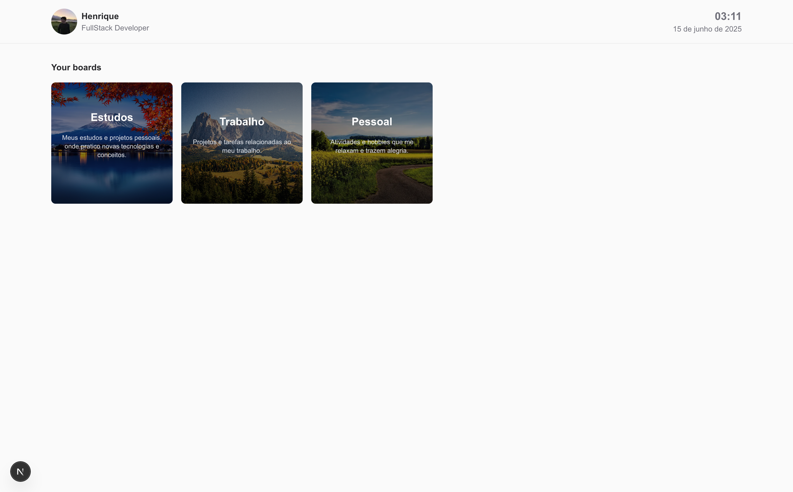

<h1 align="center" style="font-weight: bold;">Minder 💻</h1>

<p align="center">
 <a href="#technologies">Technologies</a> • 
 <a href="#architecture">Architecture</a> •
 <a href="#started">Getting Started</a> • 
 <a href="#usage">Usage</a> •
 <a href="#colab">Collaborators</a> •
 <a href="#contribute">Contribute</a>
</p>

<p align="center">
    <b>Microservice-based task management system with scalable architecture and asynchronous processing</b>
</p>

<p align="center">
    
</p>

## Tech Stack 🐋

<!--- # "Verify icons availability here https://github.com/tandpfun/skill-icons" -->

[](https://skillicons.dev)

<h2 id="technologies">💻 Technologies</h2>

### Backend
- **Java 21** with **Spring Boot 3.5**
- **Spring Security** with JWT Authentication
- **Spring Data JPA** with PostgreSQL
- **Spring AMQP** for RabbitMQ integration
- **Maven** for dependency management

### Frontend (Planned)
- **Next.js** with TypeScript
- **Tailwind CSS** for styling
- **React Query** for data fetching

### Infrastructure
- **Docker** and **Docker Compose** for containerization
- **RabbitMQ** for message queuing
- **PostgreSQL** for data persistence
- **Terraform** for infrastructure as code

<h2 id="architecture">🏗️ Architecture</h2>

Minder follows a microservice architecture with asynchronous message processing:

1. **API Service** - REST API for task management with JWT authentication
2. **Worker Service** - Asynchronous task processing
3. **Message Broker** - RabbitMQ for service communication
4. **Database** - PostgreSQL for data persistence

**Communication Flow:**
- API receives HTTP requests and stores data in PostgreSQL
- API publishes events to RabbitMQ for background processing
- Worker consumes messages from RabbitMQ and performs necessary operations

<h2 id="started">🚀 Getting Started</h2>

<h3>Prerequisites</h3>

- [Docker](https://www.docker.com/) and [Docker Compose](https://docs.docker.com/compose/)
- [Java 17](https://www.oracle.com/java/technologies/downloads/)
- [Maven](https://maven.apache.org/)
- [Terraform](https://www.terraform.io/) (for infrastructure setup)

<h3>Cloning</h3>

```bash
git clone https://github.com/henriquemtn/minder.git
cd minder
```

<h3>Starting</h3>

1. **Set up RabbitMQ infrastructure:**

```bash
cd terraform/rabbitmq
terraform init
terraform apply
```

2. **Start all services with Docker Compose:**

```bash
cd ../..
docker-compose up -d
```

3. **Verify services are running:**

```bash
docker-compose ps
```

<h2 id="usage">🧩 Usage</h2>

### Authentication

1. **Register a new user:**

```bash
curl -X POST http://localhost:8080/api/auth/register \
  -H "Content-Type: application/json" \
  -d '{
    "username": "user1",
    "password": "password123",
    "email": "user1@example.com",
    "firstName": "John",
    "lastName": "Doe"
  }'
```

2. **Login to get JWT token:**

```bash
curl -X POST http://localhost:8080/api/auth/login \
  -H "Content-Type: application/json" \
  -d '{
    "username": "user1",
    "password": "password123"
  }'
```

### Task Management

Use the JWT token from login for all task operations:

1. **Create a task:**

```bash
curl -X POST http://localhost:8080/api/tasks \
  -H "Content-Type: application/json" \
  -H "Authorization: Bearer YOUR_JWT_TOKEN" \
  -d '{
    "title": "Complete project documentation",
    "description": "Write detailed documentation for the Minder project"
  }'
```

2. **Get all tasks:**

```bash
curl -X GET http://localhost:8080/api/tasks \
  -H "Authorization: Bearer YOUR_JWT_TOKEN"
```

3. **Get task by ID:**

```bash
curl -X GET http://localhost:8080/api/tasks/{taskId} \
  -H "Authorization: Bearer YOUR_JWT_TOKEN"
```

4. **Update task:**

```bash
curl -X PUT http://localhost:8080/api/tasks/{taskId} \
  -H "Content-Type: application/json" \
  -H "Authorization: Bearer YOUR_JWT_TOKEN" \
  -d '{
    "title": "Updated task title",
    "description": "Updated task description",
    "status": "IN_PROGRESS"
  }'
```

5. **Delete task:**

```bash
curl -X DELETE http://localhost:8080/api/tasks/{taskId} \
  -H "Authorization: Bearer YOUR_JWT_TOKEN"
```

<h2 id="colab">🤝 Collaborators</h2>

Special thank you for all people that contributed for this project.

<table>
  <tr>
    <td align="center">
      <a href="https://github.com/henriquemtn">
        <br>
        <sub>
          <b>Henrique Silveira</b>
        </sub>
      </a>
    </td>
  </tr>
</table>

<h2 id="contribute">📫 Contribute</h2>

We welcome contributions to the Minder project! Here's how you can help:

1. `git clone https://github.com/henriquemtn/minder-dev.git`
2. `git checkout -b feature/NAME`
3. Make your changes following our coding standards
4. Test your changes thoroughly
5. `git commit -m "feat: concise description of your changes"`
6. `git push origin feature/NAME`
7. Open a Pull Request explaining the problem solved or feature added
8. For visual changes, please include screenshots

<h3>Coding Standards</h3>

- Use meaningful variable and function names
- Write unit tests for new functionality
- Follow the existing architecture patterns
- Document API endpoints with clear examples
- Keep commits small and focused on a single change

<h3>Documentations that might help</h3>

[📝 How to create a Pull Request](https://www.atlassian.com/br/git/tutorials/making-a-pull-request)

[💾 Commit pattern](https://gist.github.com/joshbuchea/6f47e86d2510bce28f8e7f42ae84c716)